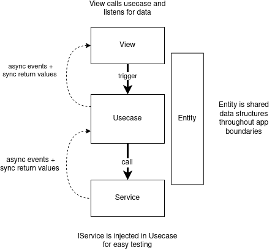

# Our architecture

### We deal with money

Testing and accuracy needs to be our priority when designing this codebase. The architectural decisions here have been made with the main goal of enabling testing at as many levels as possible. We have highly testable usecases, highly testable integration services, and a highly testable end to end stack.

### We are in an incredibly volitile fast moving market

So whilst testing is important in this space change is also to be expected so our code must be as flexible as possible. We cannot assume our code structure will remain fixed we will likley need to refactor our backing services change the way we access our technology, change our frontend. Provide API sdks and libraries based on our code. Also our important business processes things like the fees we charge invariants and business rules need to be well tested or at least when they are simple easy to add tests as we go.

- **CHANGE** is expected
- Complex business rules are likely (margin trading, limit orders, exceptions, security features)
- Protocols will likely change
- Backing services may move
- Contract calls signatures and methods may change
- Business logic may change (or not)

### We are growing fast

We are growing fast as an industry and some level of team churn should be expected we should strive to avoid knowledge silos and optimize for quick onboarding where possible. SO clarity and consistency should be somethign we value in our codebase.

### Our architecture goals

It makes sense that our architecture should be alogned with these goals that we should optimize for:

1. TESTABILITY
1. FLEXIBILITY
1. CLARITY
1. CONSISTENCY

### Questions for our code

Looking at our code and architecture we should be able to glean certain information reasonably easily.

- What does this application **do**?
- What external **services** does my app rely on?
- What does the **data** in my app look like?
- How can I **test** edge cases easily?
- Can I easily change deployment environment:
  - change my external services?
  - add a cache layer?
  - create a mobile app?
  - create a cli?

✅ Our architectural approach answers these questions

### CLEAN ARCHITECTURE

Hexagonal or clean architecture solves many of these concerns. We support a simplified version of clean architecture to help us achieve our goals.

- View - Present the UI
- Usecase - Encapsulated Application Specific Logic
- Service - Pass data to and from externalities
- Entity - Shared data structure and logic

Here is a [great short video](https://www.youtube.com/watch?v=CnailTcJV_U) on the most important concepts I highly recommend you watch if you are not familiar with Clean Architecture. Watching this should give you a good gist of how it works.

---

### Hmm ok so how should I think about this?

- We are **usecase** centric every feature needs a usecase
- Usecases know nothing they are totally portable as they depend on nothing that is not injected.
- **Services** are plugins to the usecases that allow usecases to interact with the outside world. Services pass data to and from externalities. Testing these can be difficult so they might need to be tested in e2e tests or integration tests (we do both but might depricate integration tests eventually)
- Pass data to an encapsulation using function calls
- Receive data from an encapsulation using:
  - return values for sync values
  - shared event bus for async events (ok).
  - async iterator (via generator) for async events (best).

---

### summary

- TESTABILITY - dependency inversion allows services to be swapped out for testing
- FLEXIBILITY - logic is independent of deployment, representation or frameworks
- CLARITY - code reads like a list of feature requirements
- CONSISTENCY - features consist of usecases - externalities are services - view should trigger usecases hold limited smarts and react to events

---

## Benefits of this architecture

- Better conceptual parity with user

  - Usecases demonstrates the business rules the way the business thinks about it

- Hides useless complexity

  - Details of how we serialize a blockchain transaction is irrelavent to knowing that fees are paid in ceth and that a user must have anough funds inside their wallet to cover that amount. In CA these things are separate.

- Very testable

  - Can test usecases with basic dependency injection

- Future proof

  - Assuming we make good decisions on what is "business logic"
  - Margin trading will require complex usecase scenarios
  - IBC will require lots of complex fee rules

- Avoids complex hard to follow and hard to test event chains

  - Often in Redux based architectures we have cascading events driving cascading events

- Allows for portability of business logic
  - Mobile app
  - React compatability (actually underway in sdk)
  - Console UI
- Independent of framework
- Independent of backing service
  - Can change the underlying service library without affecting the UI or the business logic
- With minor maintenance grows fairly naturally
- Universal methodology for designing systems

---

### Opinions and thoughts on the state of play

We built this thing in a hurry and made a few mistakes:

- Vue reactivity has a complex confusing mutation based API which is difficult to keep track of. Initially we had hesitancy against RxJS due to the chances that is get abused into confusing stream flows with lots of operators. With RxJS there is less magic desite a higher learning curve. RxJS might have been a better option here as a neutral flexible solution. Removing RxJS would have been difficult though so there is that too. We looked at MobX but vue didn't have a vue3 binding for it. Redux wasn't a great fit for a Vue application. `@vue/reactivity` is still used in parts of the core I would consider legacy or requiring refactor. I would phase it out as a dependency and instead rely on things like callbacks and async iterators.
- Vue was probably a mistake because of it's poor TypeScript support. We can mitigate this by only using JSX based components with CSS modules.
- I honestly consider most of the Vue side of the app to be effectively legacy code.
- I think much of the popup logic would do better to be written in some kind of statemachine - either xstate or possibly something bespoke utilizing the router as the state machine.
- There are a bunch of useless state adaptors in the Vue code for historical reasons that should be thrown out and more dynamic ways of maintaining cohesion should be used. We had to quickly fit a square peg in a round hole and we have never managed to refactor it. I tried to begin to refactor this to simplify it but we had no tests yet and we were launching too soon so it was deemed too risky to merge. Now we have some e2e tests we should take a look at refactoring it within the context of adding a feature. Basically we left rubbish in the vue code to try and keep the core pretty clean. This is the main smell https://github.com/Sifchain/sifchain-ui/blob/develop/ui/app/src/views/utils/toConfirmState.ts
- Eventually it might make sense to have each usecase in it's own file. This will make testing easier. We have started this.
- The servcies layer needs refactoring.
  - Services should have all their state removed and be refactored to be stateless. State should be tracked by the usecase layer as it should be the usecase that has all the information to navigate the state.
  - We talked about creating a provider and blockchain service abstraction when suggested there wasn't much appetite for creating this abstraction to support multiple blockchains. This has meant that the code
    allet plugins and ChainService would represent the networks those providers live on. State should be removed from the service and communicated using either simple callbacks or iterators.
- We have resorted to using a special global reactive vue object called `store` to share state between usecases and the view. This was possibly a bad idea. A query cache might have been better as it would have avoided the global dependency but our usecases mighthave become too complex for that so I am personally on the fence for that one.
