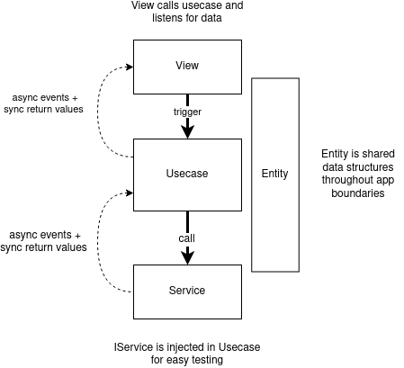

# Our architecture

### We deal with money

ACCURACY 🢂 #1 PRIORITY

∴

**TESTABILITY** 🢂 #1 PRIORITY

---

### We are in an incredibly volitile fast moving market

- **CHANGE** is expected
- Complex business rules are likely (margin trading, limit orders, exceptions, security features)
- Protocols will likely change
- Backing services may move
- Contract calls signatures and methods may change
- Business logic may change (or not)

---

### We are growing fast

Quick onboarding
needs
**CLARITY** & **CONSISTENCY**

---

### Our architecture goals

We want to optimize for:

1. TESTABILITY
1. FLEXIBILITY
1. CLARITY
1. CONSISTENCY

---

### Questions for our code

- What does this application **do**?
- What external **services** does my app rely on?
- What does the **data** in my app look like?
- How can I **test** edge cases easily?
- Can I easily change deployment environment:
  - change my external services?
  - add a cache layer?
  - create a mobile app?
  - create a cli?

---

✅ Our architectural approach answers these questions

---

### CLEAN ARCHITECTURE

We support a simplified version of clean architecture to help us achieve our goals.

- View - Present the UI
- Usecase - Encapsulated Application Specific Logic
- Service - Pass data to and from externalities
- Entity - Shared data structure and logic



---

### Hmm ok so how should I think about this?

- We are **usecase** centric every feature needs a usecase
- Usecases know nothing they are totally portable as they depend on nothing that is not injected.
- **Services** are plugins to the usecases that allow usecases to interact with the outside world. Services pass data to and from externalities. Testing these can be difficult so they might need to be tested in e2e tests or integration tests (we do both but might depricate integration tests eventually)
- Pass data to an encapsulation using function calls
- Receive data from an encapsulation using:
  - return values for sync values
  - shared event bus for async events (ok).
  - async iterator (via generator) for async events (best).

---

### summary

- TESTABILITY - dependency inversion allows services to be swapped out for testing
- FLEXIBILITY - logic is independent of deployment, representation or frameworks
- CLARITY - code reads like a list of feature requirements
- CONSISTENCY - features consist of usecases - externalities are services - view should trigger usecases hold limited smarts and react to events

---

## Benefits of this architecture

- Better conceptual parity with user

  - Usecases demonstrates the business rules the way the business thinks about it

- Hides useless complexity

  - Details of how we serialize a blockchain transaction is irrelavent to knowing that fees are paid in ceth and that a user must have anough funds inside their wallet to cover that amount. In CA these things are separate.

- Very testable

  - Can test usecases with basic dependency injection

- Future proof

  - Assuming we make good decisions on what is "business logic"
  - Margin trading will require complex usecase scenarios
  - IBC will require lots of complex fee rules

- Avoids complex hard to follow and hard to test event chains

  - Often in Redux based architectures we have cascading events driving cascading events

- Allows for portability of business logic
  - Mobile app
  - React compatability (actually underway in sdk)
  - Console UI
- Independent of framework
- Independent of backing service
  - Can change the underlying service library without affecting the UI or the business logic
- With minor maintenance grows fairly naturally
- Universal methodology for designing systems

---

### What we still need to do (as of 6/21)

- Formulate a better and more consistent way to handle async data. Using a Generator might make it simpler to listen for async events from a specific usecase for example.
  ```js
  for await (const event of usecase.peg(data)) {
    txStatus.value = event;
  }
  ```
- We use shared reactive objects in our calculators this means calculators actively mutate external data. Instead they could run callbacks and let the caller manage state updates. Because of the nature of vue reactivity it might be easiest to convert the calculators to pure functions.

- We built this thing in a hurry and made some mistakes:
  - We have resorted to using a special global reactive vue object called `store` to share state between usecases and the view. This was likely a bad idea. A query cache would have been better as it would have avoided the global dependency. Vue reactivity has a complex confusing mutation based API which is difficult to keep track of. We might want to consider removing it in favour of utilizing events whether through event dispatchers or generators.
  - Eventually it might make sense to have each usecase in it's own file.

---

### Some minor issues

- Our services are where much of the complexity lies within our app
- Danger when usecase logic ends up in the view or in the service
- Basic understanding of the architecture is important to avoid code rot
